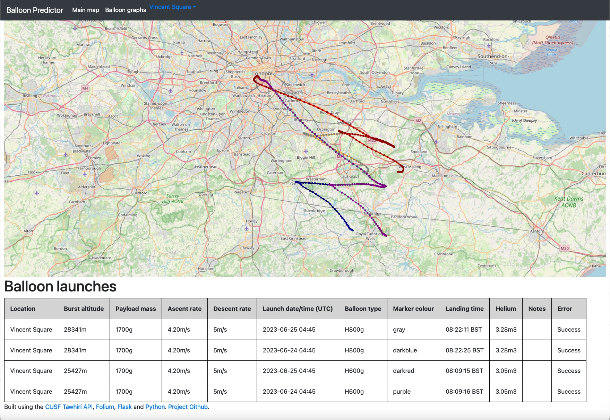
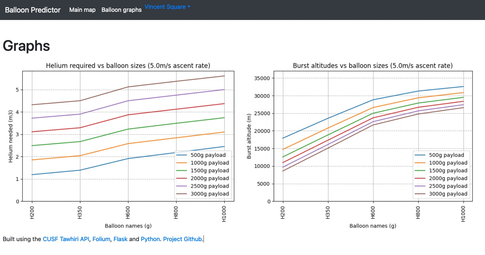

# Balloon Predictor
A multiple high altitude weather balloon flight path prediction system, based on the CUSF Tawhiri predictor API.   
The system allows for multiple balloon paths to be overlaid on top of each other to compare different launch dates/times/configurations.   
It includes a copy of the balloon burst calculator (converted from Javascript to Python) to automatically calculate estimated burst altitudes/helium quantities required.   



## Graphs
There is also a built in graph generator that shows burst altitudes with different common balloons and helium required.
The configuration it uses to generate the graphs can be edited within the URL. For example:
`/graphs/ascent/5/2000`
Would generate a graph for a 5m/s ascent rate for a 2000g payload.   
If the payload weight isn't specified, the system will show multiple options.    


# Usage   
The system is a Python Flask hosted site. It can be run locally relatively easily and also includes a Dockerfile.

## Setup Instructions

Follow these steps to set up the Python Flask based project:

1. Clone the repository:

   ```bash
   git clone https://github.com/gbaman/Balloon_Predictor
   ```
2. Navigate to the project directory:
    ```bash
    cd Balloon_Predictor
    ```
3. Install the project dependencies (you may wish to use a virtual environment):
    ```bash
   pip install -r requirements.txt 
   ```
3. Copy the default config file:
    ```bash
   cp balloon_predictor/config_example.py balloon_predictor/config.py
   ```
5. Edit the config file (see comments within it).
6. Run the Flask web server
    ```bash
   python main.py
   ```
7. Open a web browser and navigate to http://localhost:5000 to access the project.